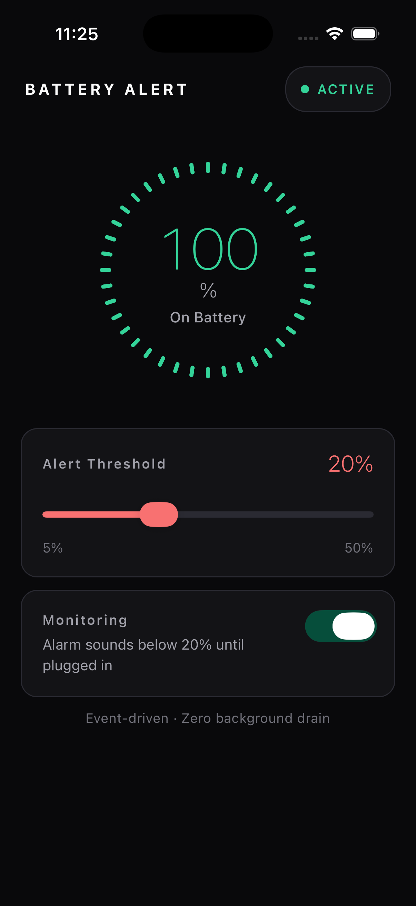

# Battery Alert

A cross-platform React Native app that monitors your battery level and sounds a persistent alarm when it drops below your chosen threshold. The alarm only stops when you plug in your charger.

Built for people who forget to charge their phone and end up with a dead battery during the day.

<p align="center">
  
</p>

## Features

- Set a custom battery threshold (5%–50%)
- Persistent alarm sound that only stops when you plug in
- Event-driven monitoring with zero background battery drain
- Works on both Android and iOS
- WCAG AA accessible for older users
- Dark theme to save battery on OLED screens

## Install

Download the latest APK from [Releases](https://github.com/and/battery/releases).

## Build from source

```sh
npm install
```

**Android:**
```sh
npx react-native run-android
```

**iOS:**
```sh
cd ios && bundle exec pod install && cd ..
npx react-native run-ios
```

## License

MIT
